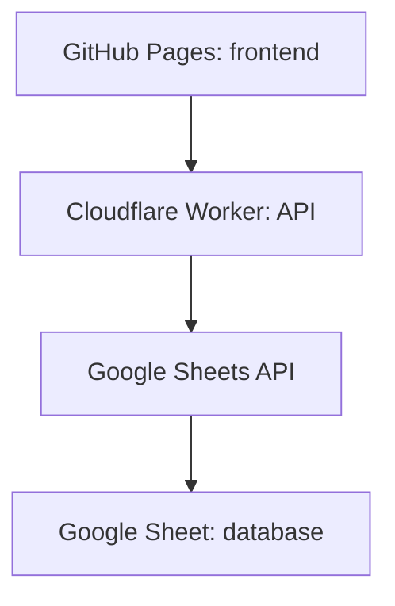

# Deploy with GitHub Pages + Cloudflare Worker

ทางนี้เหมาะเมื่ออยากให้หน้าเว็บอยู่บน GitHub และลดข้อจำกัดของ Apps Script เรื่อง CORS หน้าเว็บจะ deploy ผ่าน GitHub Pages ส่วน API จะอยู่บน Cloudflare Worker

## ภาพรวม



## 1. สร้าง Google Sheet

1. สร้าง Google Sheet ใหม่
2. Copy Sheet ID จาก URL
3. Share Sheet ให้ service account email เป็น Editor

## 2. สร้าง Google Cloud Service Account

1. เปิด Google Cloud Console
2. สร้าง Project หรือใช้ Project เดิม
3. Enable Google Sheets API
4. สร้าง Service Account
5. สร้าง JSON key
6. เก็บค่า `client_email` และ `private_key`

## 3. Deploy Cloudflare Worker

ติดตั้ง dependency ของ Worker:

```bash
cd worker
npm install
```

คัดลอก `worker/wrangler.toml.example` เป็น `worker/wrangler.toml`

ตั้งค่าใน `wrangler.toml`:

```toml
SPREADSHEET_ID = "Google Sheet ID"
GOOGLE_CLIENT_EMAIL = "service-account@project.iam.gserviceaccount.com"
ALLOWED_ORIGIN = "https://YOUR_GITHUB_USERNAME.github.io"
SETUP_SECRET = "ข้อความลับยาว ๆ"
```

ตั้งค่า private key เป็น secret:

```bash
npx wrangler secret put GOOGLE_PRIVATE_KEY
```

ตอนถามค่า ให้ paste ค่า `private_key` จาก JSON key ทั้งก้อน

Deploy:

```bash
npm run deploy
```

## 4. สร้าง Sheet เริ่มต้น

หลัง deploy Worker แล้ว เรียก API นี้หนึ่งครั้ง:

```bash
cd ..
WORKER_URL="https://YOUR_WORKER_URL" \
SETUP_SECRET="ข้อความลับเดียวกับ SETUP_SECRET" \
npm run setup:worker
```

ตรวจ Worker หลัง setup:

```bash
WORKER_URL="https://YOUR_WORKER_URL" npm run verify:worker
```

## 5. ตั้งค่า GitHub Pages ให้เรียก Worker

ใน GitHub repo ไปที่ Settings > Secrets and variables > Actions > Variables แล้วเพิ่ม:

| Name | Value |
|---|---|
| API_BASE_URL | Worker URL เช่น `https://family-expense-api.yourname.workers.dev` |
| DEMO_MODE | `false` |

ถ้ายังไม่ตั้ง `API_BASE_URL` ระบบจะ deploy เป็น demo mode เพื่อให้เปิดหน้าเว็บดูได้ก่อน แต่ข้อมูลจะยังไม่เข้า Google Sheets

## 6. เปิด GitHub Pages

1. Push repo ไป GitHub branch `main`
2. ไปที่ Settings > Pages
3. Source: GitHub Actions
4. เปิด Actions tab แล้วรอ workflow `Deploy frontend to GitHub Pages` สำเร็จ

## 7. ทดสอบหลัง deploy

1. เปิด GitHub Pages URL
2. Login ด้วย `โอม / 123456`
3. เพิ่มรายจ่าย 1 รายการ
4. เปิด Google Sheet แล้วตรวจว่าข้อมูลเข้า Sheet `Expenses`
5. Logout แล้ว login เป็น `ป๊า / 111111` ตรวจว่าเห็นข้อมูลแต่ไม่มีปุ่มเพิ่ม/แก้ไข/ลบ

## เปลี่ยน PIN

สร้าง hash ของ PIN ใหม่ได้ด้วย:

```bash
npm run hash:pin -- 654321
```

นำค่าที่ได้ไปใส่ใน Sheet `Users` ช่อง `pinHash`
